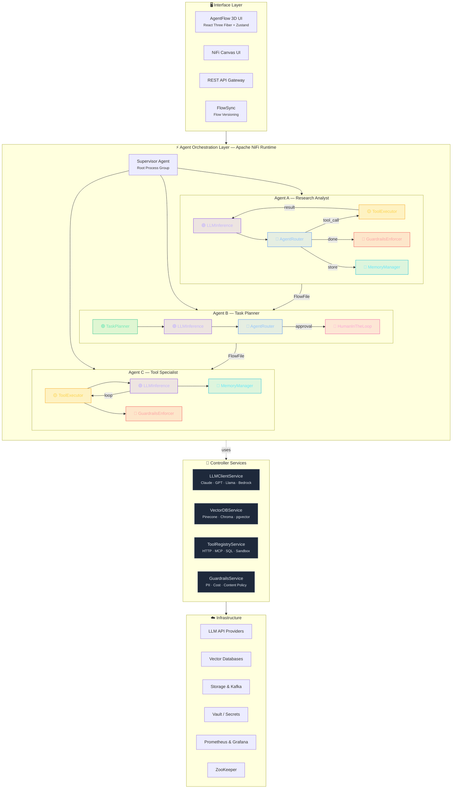

# AgentFlow — Agentic AI Platform on Apache NiFi

## Product Vision

**AgentFlow** is an enterprise-grade Agentic AI orchestration platform built on Apache NiFi. It reimagines NiFi's dataflow paradigm — processors, process groups, connections, and FlowFiles — as the building blocks for composing, orchestrating, and governing autonomous AI agents at scale.

---

## Why Apache NiFi?

| NiFi Concept           | Agentic AI Mapping                          |
|------------------------|---------------------------------------------|
| Process Group          | An autonomous Agent (or Agent Team)         |
| Processor              | An agent capability (LLM call, tool, plan)  |
| FlowFile               | A Task/Message passed between agents        |
| FlowFile Attributes    | Task metadata, context, routing hints       |
| FlowFile Content       | Full task payload, conversation history      |
| Connection / Queue     | Agent communication channel with buffering  |
| Back-pressure          | Rate-limiting agents, preventing overload   |
| Data Provenance        | Full audit trail of every agent action       |
| Controller Service     | Shared resources (LLM clients, vector DBs)  |
| Parameter Context      | Agent configuration (prompts, model, temp)   |
| FlowSync          | Versioned agent blueprints                   |
| Clustering             | Horizontal scaling of agent workloads        |
| Bulletin Board         | Real-time agent error/status reporting       |

---

## High-Level Architecture

> **Interactive diagrams available:** See [`docs/architecture.html`](docs/architecture.html) for an interactive version and [`docs/architecture.svg`](docs/architecture.svg) for a high-resolution SVG.



---

## Core Components

### 1. Custom Agent Processors (NAR Bundle)

These are custom NiFi processors packaged as a NAR (NiFi Archive) that provide AI agent capabilities.

#### LLMInference Processor
```
┌──────────────────────────────────────┐
│         LLMInference Processor       │
│                                      │
│  Properties:                         │
│  ├─ LLM Client Service  [ref]       │
│  ├─ Model ID            [string]    │
│  ├─ System Prompt        [EL/text]   │
│  ├─ Temperature          [0.0-2.0]   │
│  ├─ Max Tokens           [int]       │
│  ├─ Response Format      [text/json] │
│  ├─ Tool Definitions     [json]      │
│  └─ Streaming Enabled    [bool]      │
│                                      │
│  Relationships:                      │
│  ├─ success     → next processor     │
│  ├─ tool_call   → ToolExecutor       │
│  ├─ failure     → error handling     │
│  └─ rate_limit  → retry/backoff      │
│                                      │
│  FlowFile Output Attributes:         │
│  ├─ llm.response.text                │
│  ├─ llm.tool_calls (JSON array)      │
│  ├─ llm.tokens.input                 │
│  ├─ llm.tokens.output                │
│  ├─ llm.model.id                     │
│  └─ llm.finish_reason                │
└──────────────────────────────────────┘
```

#### ToolExecutor Processor
```
┌──────────────────────────────────────┐
│        ToolExecutor Processor        │
│                                      │
│  Properties:                         │
│  ├─ Tool Registry Service    [ref]   │
│  ├─ Execution Timeout        [time]  │
│  ├─ Sandbox Mode             [bool]  │
│  ├─ Max Concurrent Calls     [int]   │
│  └─ Allowed Tool Names       [list]  │
│                                      │
│  Relationships:                      │
│  ├─ success        → back to LLM    │
│  ├─ failure        → error handling  │
│  ├─ requires_human → HumanApproval  │
│  └─ unauthorized   → guardrails     │
│                                      │
│  Reads FlowFile Attributes:          │
│  ├─ llm.tool_calls                   │
│  Writes:                             │
│  ├─ tool.result (JSON)               │
│  ├─ tool.name                        │
│  └─ tool.execution_time_ms           │
└──────────────────────────────────────┘
```

#### MemoryManager Processor
```
┌──────────────────────────────────────┐
│       MemoryManager Processor        │
│                                      │
│  Properties:                         │
│  ├─ VectorDB Service        [ref]   │
│  ├─ Operation          [read/write]  │
│  ├─ Collection Name     [string]     │
│  ├─ Embedding Model     [string]     │
│  ├─ Top-K Results        [int]       │
│  ├─ Similarity Threshold [float]     │
│  └─ Memory Scope    [agent/global]   │
│                                      │
│  Relationships:                      │
│  ├─ success → enriched FlowFile      │
│  └─ failure → error handling         │
│                                      │
│  FlowFile Output Attributes:         │
│  ├─ memory.results (JSON array)      │
│  ├─ memory.result_count              │
│  └─ memory.operation_type            │
└──────────────────────────────────────┘
```

#### TaskPlanner Processor
```
┌──────────────────────────────────────┐
│        TaskPlanner Processor         │
│                                      │
│  Properties:                         │
│  ├─ LLM Client Service      [ref]   │
│  ├─ Planning Strategy                │
│  │   [ReAct / Plan-and-Execute /     │
│  │    Tree-of-Thought / Custom]      │
│  ├─ Max Planning Depth       [int]   │
│  ├─ Available Agent List     [json]  │
│  └─ Goal Decomposition      [bool]   │
│                                      │
│  Relationships:                      │
│  ├─ subtask    → route to sub-agent  │
│  ├─ complete   → aggregation         │
│  └─ failure    → re-plan / escalate  │
│                                      │
│  Output:                             │
│  ├─ plan.steps (JSON array)          │
│  ├─ plan.current_step                │
│  └─ plan.assigned_agent              │
└──────────────────────────────────────┘
```

#### AgentRouter Processor
```
┌──────────────────────────────────────┐
│        AgentRouter Processor         │
│                                      │
│  Properties:                         │
│  ├─ Routing Strategy                 │
│  │   [LLM-based / Rule-based /      │
│  │    Skill-match / Round-robin]     │
│  ├─ Agent Registry           [json]  │
│  ├─ Fallback Agent           [ref]   │
│  └─ Max Delegation Depth     [int]   │
│                                      │
│  Dynamic Relationships:              │
│  ├─ agent.researcher                 │
│  ├─ agent.coder                      │
│  ├─ agent.analyst                    │
│  └─ agent.<name> (auto-created)      │
└──────────────────────────────────────┘
```

#### HumanInTheLoop Processor
```
┌──────────────────────────────────────┐
│      HumanInTheLoop Processor        │
│                                      │
│  Properties:                         │
│  ├─ Approval Channel  [UI/Slack/API] │
│  ├─ Timeout            [duration]    │
│  ├─ Auto-approve Rules [json]        │
│  ├─ Notification Service     [ref]   │
│  └─ Escalation Policy  [json]        │
│                                      │
│  Relationships:                      │
│  ├─ approved   → continue flow       │
│  ├─ rejected   → alternative path    │
│  └─ timed_out  → escalation          │
│                                      │
│  Behavior:                           │
│  FlowFile is held in queue until     │
│  human responds via UI/API/Slack.    │
│  NiFi's penalization & back-pressure │
│  handle the wait naturally.          │
└──────────────────────────────────────┘
```

#### GuardrailsEnforcer Processor
```
┌──────────────────────────────────────┐
│      GuardrailsEnforcer Processor    │
│                                      │
│  Properties:                         │
│  ├─ Guardrails Service       [ref]   │
│  ├─ Check Input/Output       [both]  │
│  ├─ PII Detection            [bool]  │
│  ├─ Content Policy Rules     [json]  │
│  ├─ Cost Budget Per Task     [float] │
│  ├─ Token Budget Per Task    [int]   │
│  └─ Max Loop Iterations      [int]   │
│                                      │
│  Relationships:                      │
│  ├─ pass     → continue              │
│  ├─ violation → quarantine/log       │
│  └─ budget_exceeded → halt           │
└──────────────────────────────────────┘
```

---

### 2. Agent as a Process Group

Each agent is a self-contained NiFi Process Group with a standardized internal structure:

```
┌─────────────────────────────────────────────────────────────────┐
│                  AGENT: "Research Analyst"                       │
│                  (NiFi Process Group)                            │
│                                                                 │
│  Parameter Context:                                             │
│  ├─ agent.name = "Research Analyst"                             │
│  ├─ agent.role = "You are a senior research analyst..."         │
│  ├─ agent.model = "claude-sonnet-4-6"                           │
│  ├─ agent.temperature = 0.3                                     │
│  ├─ agent.max_iterations = 10                                   │
│  └─ agent.tools = ["web_search", "read_document", "summarize"] │
│                                                                 │
│  ┌─────────┐   ┌────────────┐   ┌──────────┐                  │
│  │ Input   │──▶│ Guardrails │──▶│ Memory   │                  │
│  │ Port    │   │ (Pre-check)│   │ Retrieve │                  │
│  └─────────┘   └────────────┘   └────┬─────┘                  │
│                                      │                          │
│                                 ┌────▼──────┐                  │
│                          ┌─────▶│ LLM Call  │◀────┐            │
│                          │      │           │     │            │
│                          │      └─────┬─────┘     │            │
│                          │            │           │            │
│                          │      ┌─────▼─────┐    │            │
│                          │      │  Router    │    │            │
│                          │      │ (decision) │    │            │
│                          │      └──┬───┬──┬──┘    │            │
│                          │         │   │  │       │            │
│                    ┌─────┘   ┌─────▼┐ │ ┌▼─────┐ │            │
│                    │         │ Tool  │ │ │Memory│ │            │
│                    │         │ Exec  │ │ │Write │ │            │
│                    │         └───┬───┘ │ └──────┘ │            │
│                    │             │     │          │            │
│                    │    tool     │     │          │            │
│                    │    result   │     │          │            │
│                    └─────────────┘     │          │            │
│                                       │ done     │            │
│                                  ┌────▼──────┐   │            │
│                                  │ Guardrails│   │            │
│                                  │(Post-chk) │   │            │
│                                  └────┬──────┘   │            │
│                                       │          │            │
│                                  ┌────▼──────┐   │            │
│                                  │ Output    │   │            │
│                                  │ Port      │   │            │
│                                  └───────────┘   │            │
│                                                  │            │
│         The LLM ◀──▶ Tool loop repeats until     │            │
│         the LLM decides the task is complete ─────┘            │
│                                                                 │
│  Input Port:  Receives task FlowFiles from other agents         │
│  Output Port: Emits completed task FlowFiles                    │
└─────────────────────────────────────────────────────────────────┘
```

---

### 3. Multi-Agent Collaboration Patterns

#### Pattern A: Sequential Pipeline
```
  ┌──────────┐    ┌──────────┐    ┌──────────┐    ┌──────────┐
  │ Intake   │───▶│Researcher│───▶│ Analyst  │───▶│ Writer   │
  │ Agent    │    │ Agent    │    │ Agent    │    │ Agent    │
  └──────────┘    └──────────┘    └──────────┘    └──────────┘
  Receives task    Gathers data    Analyzes        Produces final
  and validates    from sources    findings        output
```

#### Pattern B: Supervisor / Worker
```
                      ┌──────────────┐
                      │  Supervisor  │
            ┌────────▶│    Agent     │◀────────┐
            │         │  (Planner +  │         │
            │         │   Router)    │         │
            │         └──┬───┬───┬──┘         │
            │            │   │   │            │
         results     ┌───▼┐ ┌▼──┐ ┌▼───┐    results
            │        │ W1 │ │W2 │ │ W3 │      │
            └────────│    │ │   │ │    │──────┘
                     └────┘ └───┘ └────┘
                     Worker Agents (parallel)
```

#### Pattern C: Debate / Consensus
```
           ┌──────────┐         ┌──────────┐
           │ Agent A   │◀───────▶│ Agent B   │
           │ (Pro)     │         │ (Con)     │
           └─────┬─────┘         └─────┬─────┘
                 │                     │
                 └──────────┬──────────┘
                       ┌────▼────┐
                       │  Judge  │
                       │  Agent  │
                       └─────────┘
                    Synthesizes final
                    consensus output
```

#### Pattern D: MapReduce Fan-out
```
                    ┌────────────┐
                    │  Splitter  │
                    │ (breaks    │
                    │  task into │
                    │  N parts)  │
                    └──┬──┬──┬──┘
                       │  │  │
              ┌────────┘  │  └────────┐
              ▼           ▼           ▼
         ┌────────┐  ┌────────┐  ┌────────┐
         │Agent 1 │  │Agent 2 │  │Agent 3 │
         │(chunk) │  │(chunk) │  │(chunk) │
         └───┬────┘  └───┬────┘  └───┬────┘
              │           │           │
              └─────┬─────┘───────────┘
                    ▼
              ┌───────────┐
              │ Aggregator│
              │ (merges   │
              │  results) │
              └───────────┘
```

---

### 4. FlowFile Structure for Agent Tasks

The FlowFile is the unit of work flowing between agents. It carries the full task context:

```
┌─────────────────────────────────────────────────────┐
│                  FLOWFILE                             │
│                                                      │
│  ATTRIBUTES (metadata):                              │
│  ├─ task.id           = "uuid-1234"                  │
│  ├─ task.type         = "research_query"             │
│  ├─ task.priority     = "high"                       │
│  ├─ task.created_at   = "2026-03-10T..."             │
│  ├─ task.parent_id    = "uuid-0000" (if subtask)     │
│  ├─ task.origin_agent = "supervisor"                 │
│  ├─ task.target_agent = "researcher"                 │
│  ├─ task.iteration    = 3                            │
│  ├─ task.max_iter     = 10                           │
│  ├─ task.token_budget = 50000                        │
│  ├─ task.tokens_used  = 12340                        │
│  ├─ task.status       = "in_progress"                │
│  └─ task.trace_id     = "trace-5678"                 │
│                                                      │
│  CONTENT (payload as JSON):                          │
│  {                                                   │
│    "goal": "Research recent trends in...",           │
│    "conversation_history": [                         │
│      {"role": "user", "content": "..."},             │
│      {"role": "assistant", "content": "..."},        │
│      {"role": "tool", "content": "..."}              │
│    ],                                                │
│    "plan": {                                         │
│      "steps": [...],                                 │
│      "current_step": 2                               │
│    },                                                │
│    "tool_results": [...],                            │
│    "memory_context": [...],                          │
│    "final_output": null                              │
│  }                                                   │
└─────────────────────────────────────────────────────┘
```

---

### 5. Controller Services

Shared, reusable services configured at the NiFi controller level:

```
┌─────────────────────────────────────────────────────────────────┐
│                    CONTROLLER SERVICES                           │
│                                                                 │
│  ┌─────────────────────────────────────────────────────────┐   │
│  │  LLMClientService                                       │   │
│  │  ├─ Provider: Anthropic / OpenAI / Bedrock / Ollama     │   │
│  │  ├─ API Key: ${vault:llm-api-key}                       │   │
│  │  ├─ Base URL: https://api.anthropic.com                 │   │
│  │  ├─ Connection Pool Size: 20                            │   │
│  │  ├─ Retry Policy: exponential backoff                   │   │
│  │  └─ Rate Limit: 1000 req/min                            │   │
│  └─────────────────────────────────────────────────────────┘   │
│                                                                 │
│  ┌─────────────────────────────────────────────────────────┐   │
│  │  VectorDBService                                        │   │
│  │  ├─ Provider: Pinecone / ChromaDB / pgvector / Weaviate │   │
│  │  ├─ Connection String: ${vault:vectordb-conn}           │   │
│  │  ├─ Default Collection: "agent_memory"                  │   │
│  │  └─ Embedding Model: text-embedding-3-large             │   │
│  └─────────────────────────────────────────────────────────┘   │
│                                                                 │
│  ┌─────────────────────────────────────────────────────────┐   │
│  │  ToolRegistryService                                    │   │
│  │  ├─ Registered Tools:                                   │   │
│  │  │  ├─ web_search    (HTTP API)                         │   │
│  │  │  ├─ code_executor (Sandboxed container)              │   │
│  │  │  ├─ sql_query     (JDBC, read-only)                  │   │
│  │  │  ├─ file_reader   (S3/GCS)                           │   │
│  │  │  ├─ email_sender  (SMTP, requires approval)          │   │
│  │  │  └─ mcp_client    (Model Context Protocol)           │   │
│  │  ├─ Tool Sandboxing: Docker / gVisor                    │   │
│  │  └─ Execution Timeout: 30s                              │   │
│  └─────────────────────────────────────────────────────────┘   │
│                                                                 │
│  ┌─────────────────────────────────────────────────────────┐   │
│  │  GuardrailsService                                      │   │
│  │  ├─ Content Policies: [json rules]                      │   │
│  │  ├─ PII Detection: enabled                              │   │
│  │  ├─ Cost Ceiling Per Task: $5.00                        │   │
│  │  ├─ Max Iterations Per Agent: 25                        │   │
│  │  ├─ Prohibited Actions: [delete_prod, send_money, ...]  │   │
│  │  └─ Audit Logging: enabled                              │   │
│  └─────────────────────────────────────────────────────────┘   │
│                                                                 │
│  ┌─────────────────────────────────────────────────────────┐   │
│  │  AgentStateService                                      │   │
│  │  ├─ State Backend: Redis / NiFi State Provider          │   │
│  │  ├─ Session TTL: 24h                                    │   │
│  │  └─ Enables long-running agent sessions across restarts │   │
│  └─────────────────────────────────────────────────────────┘   │
└─────────────────────────────────────────────────────────────────┘
```

---

### 6. Agent Lifecycle & Agentic Loop

How a single agent (Process Group) processes a task:

```
                         ┌─────────────────────┐
                         │    TASK RECEIVED     │
                         │    (FlowFile in)     │
                         └──────────┬──────────┘
                                    │
                         ┌──────────▼──────────┐
                         │  INPUT GUARDRAILS    │
                         │  - Validate task     │
                         │  - Check budget      │
                         │  - PII scan          │
                         └──────────┬──────────┘
                                    │ pass
                         ┌──────────▼──────────┐
                         │  RETRIEVE MEMORY     │
                         │  - Relevant context  │
                         │  - Past interactions │
                         │  - Knowledge base    │
                         └──────────┬──────────┘
                                    │
                    ┌───────────────▼───────────────┐
              ┌────▶│        LLM INFERENCE          │
              │     │  - System prompt (from params) │
              │     │  - Task + memory + history     │
              │     │  - Available tools             │
              │     └───────────┬───────────────────┘
              │                 │
              │     ┌───────────▼───────────────┐
              │     │    RESPONSE ROUTER         │
              │     │  (Examine finish_reason)   │
              │     └──┬────────┬────────────┬──┘
              │        │        │            │
              │   tool_call   text      max_iterations
              │        │     (done)      (exceeded)
              │  ┌─────▼────┐  │            │
              │  │  TOOL     │  │     ┌──────▼──────┐
              │  │ EXECUTOR  │  │     │  ESCALATE   │
              │  │           │  │     │  or HALT    │
              │  └─────┬─────┘  │     └─────────────┘
              │        │        │
              │   tool result   │
              │        │        │
              │  ┌─────▼─────┐  │
              │  │ APPEND TO │  │
              │  │ HISTORY   │  │
              │  └─────┬─────┘  │
              │        │        │
              └────────┘        │
                                │
                    ┌───────────▼───────────────┐
                    │    OUTPUT GUARDRAILS       │
                    │  - Validate response       │
                    │  - PII redaction           │
                    │  - Quality check           │
                    └───────────┬───────────────┘
                                │
                    ┌───────────▼───────────────┐
                    │      STORE MEMORY          │
                    │  - Save to VectorDB        │
                    │  - Update agent state      │
                    └───────────┬───────────────┘
                                │
                    ┌───────────▼───────────────┐
                    │      EMIT RESULT           │
                    │   (FlowFile out via        │
                    │    Output Port)            │
                    └───────────────────────────┘
```

---

### 7. Observability & Governance

NiFi's built-in provenance gives you something no other agent framework has out of the box — a complete, queryable audit trail.

```
┌─────────────────────────────────────────────────────────────────┐
│                     PROVENANCE TRACE                             │
│                                                                 │
│  Every FlowFile event is recorded:                              │
│                                                                 │
│  Time         Event         Processor          Details          │
│  ─────────────────────────────────────────────────────────────  │
│  10:00:01.0   RECEIVE       InputPort          task.id=1234     │
│  10:00:01.1   ATTRIBUTES    GuardrailsPre      status=valid     │
│  10:00:01.3   CONTENT_MOD   MemoryRetrieve     +3 memories      │
│  10:00:02.1   CONTENT_MOD   LLMInference       model=claude-4   │
│  10:00:02.1   ATTRIBUTES    LLMInference       tokens=1523      │
│  10:00:02.2   ROUTE         Router             → tool_call      │
│  10:00:03.5   CONTENT_MOD   ToolExecutor       web_search       │
│  10:00:03.6   CONTENT_MOD   LLMInference       iteration 2      │
│  10:00:04.2   ROUTE         Router             → complete        │
│  10:00:04.3   ATTRIBUTES    GuardrailsPost     status=clean      │
│  10:00:04.4   CONTENT_MOD   MemoryStore        saved to vector   │
│  10:00:04.5   SEND          OutputPort         → next agent      │
│                                                                 │
│  Total: 11 events | 4.5s | 3,241 tokens | $0.012 cost          │
└─────────────────────────────────────────────────────────────────┘

┌─────────────────────────────────────────────────────────────────┐
│                    MONITORING DASHBOARD                          │
│                                                                 │
│  Agent Health          Active Tasks         Cost Tracker        │
│  ├─ Researcher  [OK]   ├─ In Queue: 12      ├─ Today: $14.20   │
│  ├─ Analyst     [OK]   ├─ Running:  4       ├─ This Week: $87  │
│  ├─ Writer   [WARN]   ├─ Complete: 156     ├─ Budget: $500     │
│  └─ Coder      [OK]   └─ Failed:   2       └─ Remaining: $413 │
│                                                                 │
│  Token Usage (24h)     Latency P50/P99     Error Rate           │
│  ├─ Input:  2.1M       ├─ 2.3s / 8.1s      ├─ 1.2%            │
│  ├─ Output: 890K       └─ Goal: <5s / <15s  └─ Goal: <2%       │
│  └─ Total:  3.0M                                                │
│                                                                 │
│  Top Errors                                                     │
│  ├─ Rate limit exceeded (3x) — Writer agent                    │
│  ├─ Tool timeout: web_search (2x) — Researcher agent           │
│  └─ Guardrail violation: PII in output (1x) — Analyst agent    │
└─────────────────────────────────────────────────────────────────┘
```

---

### 8. Deployment Architecture

```
┌──────────────────────────────────────────────────────────────────┐
│                     PRODUCTION DEPLOYMENT                        │
│                                                                  │
│  ┌────────────────────────────────────────────────────────────┐  │
│  │                  NiFi Cluster (3+ nodes)                   │  │
│  │                                                            │  │
│  │  ┌──────────┐    ┌──────────┐    ┌──────────┐            │  │
│  │  │  Node 1  │    │  Node 2  │    │  Node 3  │            │  │
│  │  │          │    │          │    │          │            │  │
│  │  │ Agent A  │    │ Agent B  │    │ Agent C  │            │  │
│  │  │ Agent D  │    │ Agent E  │    │ Agent A  │  (replica) │  │
│  │  └──────────┘    └──────────┘    └──────────┘            │  │
│  │        │              │              │                    │  │
│  │        └──────────────┼──────────────┘                    │  │
│  │                       │                                    │  │
│  │              ┌────────▼────────┐                          │  │
│  │              │  ZooKeeper      │                          │  │
│  │              │  (Coordination) │                          │  │
│  │              └─────────────────┘                          │  │
│  └────────────────────────────────────────────────────────────┘  │
│                           │                                      │
│              ┌────────────┼────────────┐                        │
│              ▼            ▼            ▼                        │
│  ┌──────────────┐ ┌────────────┐ ┌──────────────────┐          │
│  │  NiFi         │ │ Agent       │ │ External          │          │
│  │  Registry     │ │ Templates  │ │ Services          │          │
│  │  (versioned   │ │ (reusable  │ │ (LLM APIs,        │          │
│  │   flows)      │ │  agents)   │ │  VectorDB, etc.)  │          │
│  └──────────────┘ └────────────┘ └──────────────────┘          │
└──────────────────────────────────────────────────────────────────┘
```

---

## Key Product Differentiators

### 1. Visual Agent Design
Drag-and-drop agent composition in the NiFi canvas. Non-developers can understand and modify agent workflows visually.

### 2. Enterprise-Grade Governance
Every agent action is recorded in NiFi's provenance system. Full audit trail, replay capability, and compliance reporting built-in.

### 3. Back-Pressure & Flow Control
NiFi's back-pressure prevents agents from overwhelming downstream systems or burning through API budgets uncontrollably. Queues between agents buffer work naturally.

### 4. Horizontal Scalability
NiFi clustering distributes agent workloads across nodes. Scale from a single laptop to a multi-node production cluster without changing agent definitions.

### 5. Version-Controlled Agent Blueprints
FlowSync stores versioned agent definitions. Promote agents from dev → staging → production with full change tracking.

### 6. Tool Sandboxing & Safety
Tool execution is sandboxed, rate-limited, and gated by guardrails. High-risk actions require human approval via the HumanInTheLoop processor.

### 7. Heterogeneous Model Support
Mix and match LLM providers per agent. Use Claude for complex reasoning, smaller models for classification, local models for sensitive data.

### 8. MCP Native
First-class support for Model Context Protocol (MCP) — agents can connect to any MCP server as a tool source.

---

## Example Use Case: Automated Research Pipeline

```
┌─────────────────────────────────────────────────────────────────┐
│              ROOT PROCESS GROUP: "Research Pipeline"             │
│                                                                 │
│  ┌─────────┐                                                    │
│  │ ConsumeKafka │  ← Receives research requests                │
│  └─────┬───┘                                                    │
│        │                                                        │
│  ┌─────▼──────────┐                                             │
│  │ SUPERVISOR      │  Plans research strategy                   │
│  │ AGENT (PG)      │  Decomposes into subtasks                  │
│  └──┬────┬────┬───┘                                             │
│     │    │    │     Fan-out to specialist agents                │
│  ┌──▼──┐│┌───▼──┐                                               │
│  │Web  │││Data  │                                               │
│  │Search││ │Query │                                               │
│  │Agent│││Agent │                                               │
│  │(PG) │││(PG)  │                                               │
│  └──┬──┘│└──┬───┘                                               │
│     │   │   │                                                   │
│     │ ┌─▼────┐                                                  │
│     │ │Doc   │                                                  │
│     │ │Reader│                                                  │
│     │ │Agent │                                                  │
│     │ │(PG)  │                                                  │
│     │ └──┬───┘                                                  │
│     │    │                                                      │
│  ┌──▼────▼────────┐                                             │
│  │  MergeContent   │  Aggregates all findings                   │
│  └───────┬────────┘                                             │
│          │                                                      │
│  ┌───────▼────────┐                                             │
│  │ ANALYST AGENT   │  Synthesizes findings into insights        │
│  │ (PG)            │                                             │
│  └───────┬────────┘                                             │
│          │                                                      │
│  ┌───────▼────────┐                                             │
│  │ WRITER AGENT    │  Produces final report                     │
│  │ (PG)            │                                             │
│  └───────┬────────┘                                             │
│          │                                                      │
│  ┌───────▼────────┐                                             │
│  │ HumanInTheLoop  │  Human reviews before publishing          │
│  └───────┬────────┘                                             │
│          │ approved                                              │
│  ┌───────▼────────┐                                             │
│  │ PublishKafka    │  Publishes result                          │
│  └────────────────┘                                             │
└─────────────────────────────────────────────────────────────────┘
```

---

## Technology Stack Summary

| Layer              | Technology                                          |
|--------------------|-----------------------------------------------------|
| Runtime            | Apache NiFi 2.x (Java 21+)                         |
| Custom Processors  | Java NAR bundle (nifi-agentflow-nar)                |
| Coordination       | Apache ZooKeeper (NiFi clustering)                  |
| Flow Versioning    | Apache FlowSync                                |
| LLM Providers      | Anthropic, OpenAI, AWS Bedrock, Ollama (local)      |
| Vector Database    | Pinecone / ChromaDB / pgvector                      |
| Tool Sandboxing    | Docker containers / gVisor                          |
| State Management   | Redis / NiFi State Provider                         |
| Messaging          | Apache Kafka (input/output)                         |
| Secrets            | HashiCorp Vault / AWS Secrets Manager               |
| Monitoring         | Prometheus + Grafana + NiFi Provenance              |
| Agent Templates    | FlowSync + Git                                 |

---

## Getting Started (Development Roadmap)

### Phase 1: Foundation
- Custom NAR bundle with LLMInference and ToolExecutor processors
- LLMClientService controller service (Claude + OpenAI)
- Basic single-agent Process Group template

### Phase 2: Memory & Planning
- MemoryManager processor + VectorDBService
- TaskPlanner processor with ReAct loop
- AgentRouter for multi-agent delegation

### Phase 3: Governance & Safety
- GuardrailsEnforcer processor
- HumanInTheLoop processor
- Cost tracking and budget enforcement
- Agent Trace Viewer UI extension

### Phase 4: Enterprise
- FlowSync integration for agent versioning
- Cluster-aware agent scaling
- MCP tool connector
- Agent Studio UI (visual agent designer)
- Pre-built agent templates (research, coding, customer support)
